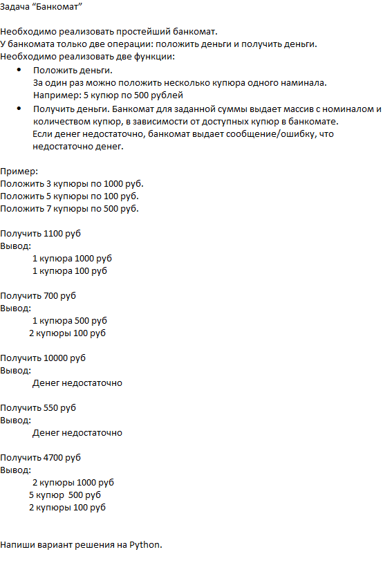
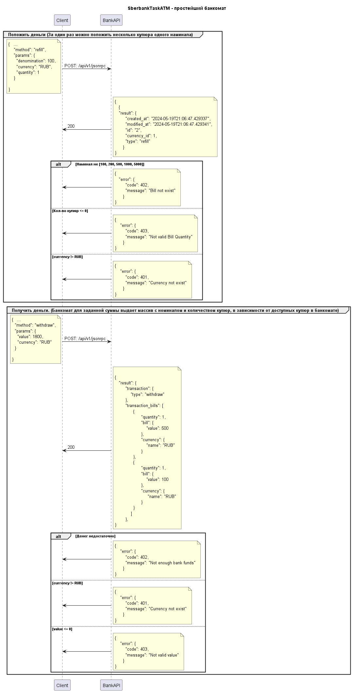
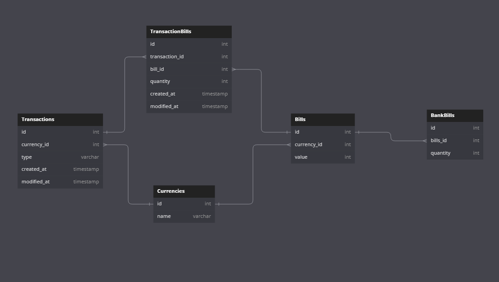

<h1 align="center">Тестовое задание "Банкомат"</h1>
<div align="center">
    
</div>

<h2 align="center">Запуск</h2>

1. Заполняем нужными конфигами файл ./sberbank_app/.env.docker
      ```
      POSTGRES_USER=postgres
      POSTGRES_PASSWORD=qwerty
      ```
2. Запуск через докер ./
   ```
      sudo docker-compose build
      sudo docker-compose up
   ```
   
3. Документация: 
   ```
      http://0.0.0.0:8084/api/v1/docs
   ```

<h3 align="center">Роуты</h3>

<div align="center">
    
</div>

<h3 align="center">БД</h3>
<div align="center">
    
</div>